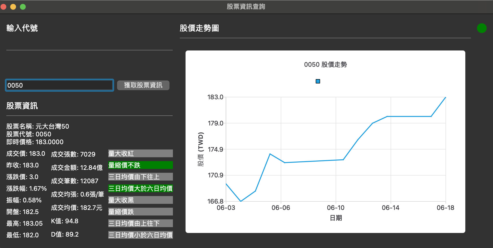

# finance_app
#### V1
* 提供輸入個股代號，便可以取得對應的個股資訊(Provide the stock ticker to retrieve the corresponding stock information)
* 顯示數值：即時價格,成交價,漲跌幅,開盤價,K值,D值等數值(Display values: real-time price, transaction price, price change percentage, opening price, K value, D value, and other values)
* 顯示狀態：量大收紅,量縮價不跌,三日均價由下往上等資訊(Display statuses: high volume closing in red, volume contraction without price drop, three-day average price rising from below, etc.)
* 顯示近期5日的股價折線圖(Display a line chart of stock prices for the past 5 days)

    

# reference
* [twstock Documentation](https://twstock.readthedocs.io/_/downloads/zh-tw/latest/pdf/)
* [Goodinfo!台灣股市資訊網](https://goodinfo.tw/tw/index.asp)